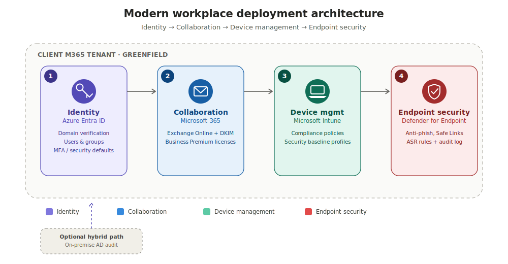

<div align="center">

# 🛡️ Modern Workplace Toolkit

### Microsoft 365 + Intune + MDE + Azure Entra ID — PowerShell Automation

**Secure, repeatable Modern Workplace deployment for SMEs, fintechs, and mid-sized banks**

[](https://learn.microsoft.com/powershell/)
[](https://learn.microsoft.com/graph/)
[](https://learn.microsoft.com/mem/intune/)
[](https://learn.microsoft.com/microsoft-365/security/defender-endpoint/)
[](#-license)

*Developed by **Dino A. Stephanus** — Cloud & Security Architect | Jakarta, Indonesia*

</div>

## 🧭 Executive Summary

Small and mid-sized organizations — banks, fintechs, and SMEs — often need enterprise-grade identity, device, and endpoint security in weeks, not months, and without a dedicated internal IT security team. **Modern Workplace Toolkit** is not a loose collection of scripts — it is a **framework**: a defined methodology, a staged architecture, and a set of design principles for standing up a secure, Microsoft-native "modern workplace" environment from a greenfield tenant. The scripts are the *implementation* of the framework, not the framework itself.

Instead of manually clicking through the M365 Admin Center, Entra ID, Intune, and Defender portals — or improvising a different sequence on every engagement — this framework codifies a consistent, auditable deployment methodology: the same four-stage architecture, the same security baseline, the same handover checklist, every time. That consistency is what scales a one-person consulting practice into something a client (or a future teammate) can trust and audit.

**Who it's for:** IT consultants, MSPs, and internal IT teams deploying Microsoft 365 environments for organizations with 10–100 users.

**What the framework provides:**
| Layer | Detail |
|---|---|
| 🧭 Methodology | A fixed four-stage deployment sequence (Identity → Collaboration → Device → Endpoint) that every engagement follows |
| 🏗️ Architecture | A documented reference architecture (see below) that scripts, checklists, and future modules are built against |
| 🧩 Design principles | Idempotent, staged, config-driven execution — see [Design Principles](#-design-principles) |
| 🗺️ Roadmap | A versioned path from script bundle to a modular, tested, multi-cloud framework — see [Roadmap](#%EF%B8%8F-roadmap) |
| 🔐 Security by default | MFA, Conditional Access, Defender for Office 365, and ASR rules enabled from day one |
| 📋 Auditability | Every step is scripted and repeatable — no undocumented manual configuration |

---

## 🧩 Design Principles

Every script, checklist, and future module in this framework is built to the same set of rules. These principles — not any single script — are what make the framework portable across engagements and contributors.

| Principle | What it means in practice |
|---|---|
| **Staged, not monolithic** | Identity → Collaboration → Device → Endpoint is a fixed sequence. Each stage is a standalone script that can run, fail, and re-run independently without breaking the others. |
| **Security by default, not by request** | MFA, Conditional Access, Defender policies, and audit logging are enabled in the baseline run — not left as a follow-up task. |
| **Config separated from logic** | Client-specific values (`$config`, `$users`) live in a clearly marked block at the top of each script, never hardcoded in the execution logic. *(Roadmap: externalized to JSON/YAML — see below.)* |
| **Idempotent where possible** | Scripts check current state before creating or modifying resources, so re-running a stage after a partial failure doesn't duplicate work. |
| **Audit-first** | Every stage produces a visible artifact — a Secure Score snapshot, an audit log entry, a credentials export — so the deployment can be reviewed after the fact, not just trusted. |
| **Handover-ready** | The framework assumes a consultant will leave. Break-glass accounts, credential handover, and admin-access revocation are part of the methodology, not an afterthought. |

**Scope:** covers identity (Entra ID), collaboration (Microsoft 365), device management (Intune), and endpoint protection (Defender for Endpoint) for greenfield tenants at a scale of 10–100 users.

---

## 🏗️ Architecture

The framework's reference architecture defines four Microsoft 365 pillars, provisioned and secured in sequence — Identity, Collaboration, Device Management, and Endpoint Security — with an optional on-premise AD audit path for hybrid migration scenarios. Every script and future module is built against this architecture.

<div align="center">
    


</div>

**Execution flow maps directly to the scripts below** — each stage is a standalone script that can be run independently, re-run safely, or paused between stages (e.g., waiting for license procurement before Step 2).

---

## 📁 Repository Structure

```
modern-workplace-toolkit/
│
├── scripts/
│   ├── ModernWorkplace-Setup.ps1         # Core setup: tenant, users, groups, MFA, Intune
│   ├── Assign-License.ps1                # Assign M365 Business Premium licenses to all users
│   ├── SecurityBaseline-Compliance.ps1   # Security baseline: CA, Defender, ASR, Audit Log
│   └── AD-Audit-Checklist.ps1            # On-premise AD audit (for hybrid/migration projects)
│
├── docs/
│   └── Checklist-Eksekusi-M365-Intune-MDE-EntraID.txt  # Full technical execution checklist
│
├── templates/
│   └── (SOW and document templates — coming soon)
│
└── README.md
```

---

## 🚀 Execution Order

Run the scripts in the following order:

### Step 1 — Core Setup
```powershell
.\scripts\ModernWorkplace-Setup.ps1
```
Covers: creating the M365 tenant, domain verification, creating 10 users + professional email, security groups, MFA (Security Defaults), Intune Compliance Policy, DKIM for Exchange Online.

### Step 2 — Assign Licenses
```powershell
.\scripts\Assign-License.ps1
```
Checks M365 Business Premium license availability, assigns to all users, verifies the result.

### Step 3 — Security Baseline
```powershell
.\scripts\SecurityBaseline-Compliance.ps1
```
Covers: 5 Conditional Access policies, Defender for Office 365 (Anti-phishing, Safe Links, Safe Attachments), Anti-Spam & Anti-Malware, SPF/DKIM/DMARC review, Intune Security Baseline, ASR Rules, Secure Score snapshot, Audit Log.

### Step 4 — (Optional) On-Premise AD Audit
```powershell
.\scripts\AD-Audit-Checklist.ps1
```
For projects with existing on-premise Active Directory planning a hybrid migration to Entra ID.

---

## ⚙️ Prerequisites

### Install the required PowerShell modules:
```powershell
Install-Module Microsoft.Graph           -Scope CurrentUser -Force
Install-Module ExchangeOnlineManagement  -Scope CurrentUser -Force
```

### Required accounts & access:
- Global Admin account for the client's M365 tenant
- A registered company domain (or a new one to be purchased)
- DNS management access for the domain
- M365 Business Premium licenses already purchased in the tenant

---

## 🔧 Configuration

Every script reads from two blocks at the top of the file — no config file, no hidden defaults. Edit these before each engagement, then run.

### Tenant settings — `$config`

```powershell
$config = @{
    Domain        = "companyname.com"       # Client domain
    CompanyName   = "PT Company Name"        # Company name
    AdminEmail    = "admin@domain.com"      # Admin email for notifications
    UsageLocation = "ID"                    # Country code: ID = Indonesia
    TempPassword  = "TempP@ssw0rd2026!"    # Temporary password for new users
}
```

| Key | Description | Example |
|---|---|---|
| `Domain` | Client's verified domain in the M365 tenant | `companyname.com` |
| `CompanyName` | Legal entity name, used in notifications and reports | `PT Company Name` |
| `AdminEmail` | Recipient for setup and audit notifications | `admin@domain.com` |
| `UsageLocation` | ISO 3166-1 alpha-2 country code, required for license assignment | `ID` |
| `TempPassword` | Temporary password issued to new users at creation | *see note below* |

> ⚠️ **`TempPassword` is a placeholder, not a production credential.** Generate a unique, random value per engagement — never reuse the sample value above. Rotate it out via `user-credentials.csv` handover (see [Important Notes](#%EF%B8%8F-important-notes)).

### User list — `$users`

```powershell
$users = @(
    @{ FirstName = "Budi"; LastName = "Santoso"; Username = "budi.santoso"; JobTitle = "CEO"; Department = "Management" },
    # ... add users as needed
)
```

| Key | Description |
|---|---|
| `FirstName` / `LastName` | Used to generate display name and mailbox |
| `Username` | Becomes the UPN prefix, e.g. `budi.santoso@companyname.com` |
| `JobTitle` | Populates the Entra ID profile field |
| `Department` | Used for group assignment and reporting |

> 💡 **Tip:** keep this list in source control per client (as a private branch or gitignored file), not in the shared framework repo — it's client PII once populated.

---

## 📊 Security Baseline Coverage

| Component | Script | Default Status |
|-----------|--------|-----------------|
| Block Legacy Authentication | SecurityBaseline-Compliance.ps1 | Enabled |
| Require MFA for All Users | SecurityBaseline-Compliance.ps1 | Enabled |
| Require Compliant Device | SecurityBaseline-Compliance.ps1 | Report-Only* |
| Block High-Risk Sign-in | SecurityBaseline-Compliance.ps1 | Enabled |
| Require MFA for Admin Roles | SecurityBaseline-Compliance.ps1 | Enabled |
| Anti-Phishing Policy | SecurityBaseline-Compliance.ps1 | Enabled |
| Safe Links Policy | SecurityBaseline-Compliance.ps1 | Enabled |
| Safe Attachments Policy | SecurityBaseline-Compliance.ps1 | Enabled |
| Anti-Spam Policy | SecurityBaseline-Compliance.ps1 | Enabled |
| Anti-Malware Policy | SecurityBaseline-Compliance.ps1 | Enabled |
| ASR Rules | SecurityBaseline-Compliance.ps1 | Audit Mode* |
| Intune Security Baseline | SecurityBaseline-Compliance.ps1 | Enabled |
| Unified Audit Log | SecurityBaseline-Compliance.ps1 | Enabled |
| Mailbox Auditing | SecurityBaseline-Compliance.ps1 | Enabled |

> *CA003 (Compliant Device): switch to Enforced once all devices are enrolled in Intune.
> *ASR Rules: review the Audit report for 1–2 weeks, then switch to Block mode.

---

## ⚠️ Important Notes

1. **Break-glass account** — create this manually in Entra before running the SecurityBaseline script, and set its UPN in `$config.BreakGlassUPN`. Store its credentials offline.
2. **DMARC** — start with `p=none` (monitoring), then move to `p=quarantine` after 2–4 weeks of reviewing reports.
3. **User credentials** — the generated `user-credentials.csv` file is sensitive. Do not send it via a WhatsApp group — hand it over securely to each user individually.
4. **Revoke admin access** — after handover is complete, revoke the consultant's Global Admin access from the client's tenant.
5. **Licensing** — make sure M365 Business Premium licenses are already available in the tenant before running `Assign-License.ps1`.

---

## 🗺️ Roadmap

Current state and near-term plans for the toolkit.

| Status | Item | Notes |
|--------|------|-------|
| ✅ Done | Core setup script | Tenant, users, groups, MFA, Intune enrollment |
| ✅ Done | License assignment script | M365 Business Premium bulk assignment |
| ✅ Done | Security baseline script | CA policies, Defender for O365, ASR, audit log |
| ✅ Done | On-premise AD audit script | Hybrid/migration readiness checklist |
| 🔨 In progress | Azure Provisioning module | Scripted subscription, resource group, and networking baseline setup |
| 🔨 In progress | EntraID Hardening module | Extended Conditional Access, PIM, and identity protection policies beyond the default baseline |
| 📋 Planned | SOW & consulting templates | Standardized statement-of-work and engagement templates under `templates/` |
| 📋 Planned | Pester test coverage | Unit/integration tests for each script before execution against a live tenant |
| 📋 Planned | CI validation | GitHub Actions running PSScriptAnalyzer + Pester on every push |
| 📋 Planned | Config-driven deployment | Move `$config`/`$users` out of script headers into a separate JSON/YAML input file |
| 💡 Exploring | Multi-cloud parity | AWS equivalent module (IAM, Organizations, GuardDuty) for hybrid Azure/AWS engagements |

Have a feature request or want to contribute to one of these? Open an issue or PR.

---
## 📄 License

MIT License — free to use and modify for consulting project needs.

---

## 👤 Author

**Dino A. Stephanus**
Cloud & Security Architect | Jakarta, Indonesia
20+ years of experience in IT Infrastructure & Cybersecurity

---
> This toolkit was built to speed up execution of Modern Workplace setup projects.
> Always review the configuration before deploying to a production environment.
